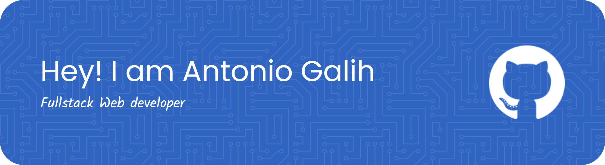

### NICE TO MEET YOU

## 🛠️ My Skill

## 🌍 Connect With Me

- 💼 Upwork: [https://www.upwork.com/freelancers/antonio_galih](https://www.upwork.com/freelancers/~01062f8c27c4492c76)
- 🌐 Portfolio: https://portfolio-pi-ochre-39.vercel.app/
- 📧 Email: antoniogalih08@gmail.com
- 💬 WhatsApp: https://wa.me/62821-3625-5430

---

✨ *“Building websites that help businesses grow and ideas come to life.”*

